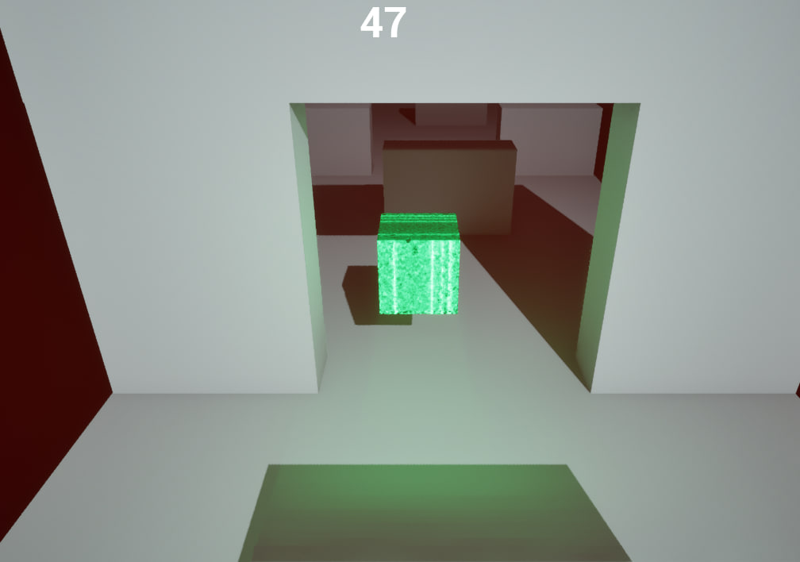
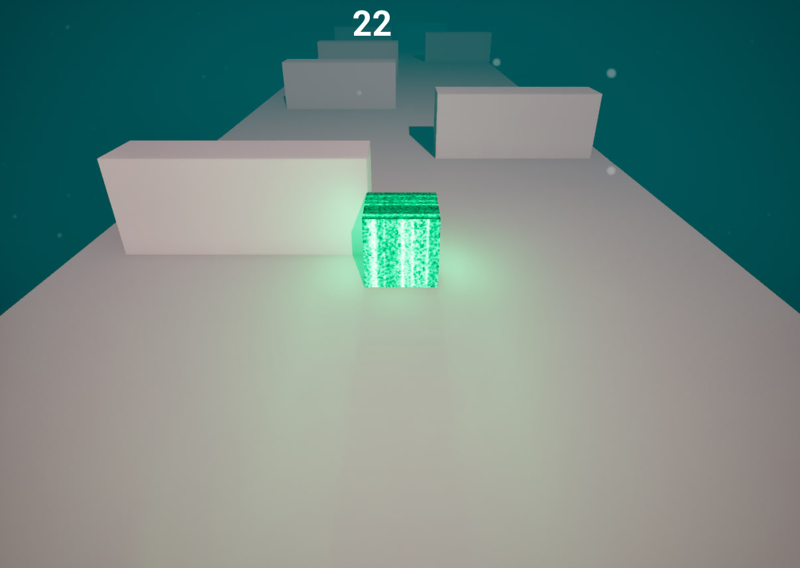
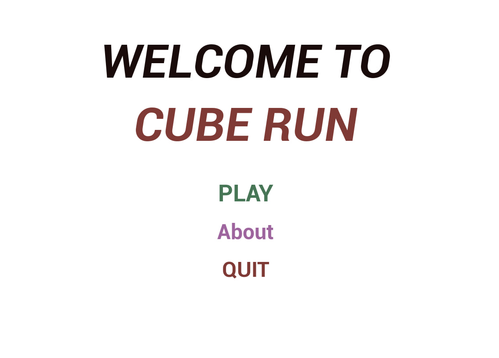

# Cube Run

Cube Run is a fast-paced third-person platformer created in Unreal Engine 5.  
This project was developed as my first experience working with the Unreal Engine and the Blueprint visual scripting system.

## About the Game

Take control of a constantly moving cube and react quickly to overcome various obstacles across challenging levels.

Precision, timing, and focus are essential as you navigate platforms, avoid hazards, and push your limits to reach the end of each stage.  
Each level becomes progressively more demanding, testing your reflexes and consistency.

## Gameplay Features

- Continuous cube movement
- Obstacle navigation
- Progressive level difficulty
- Third-person camera system
- Basic UI elements

## Technologies Used

- Unreal Engine 5
- Blueprint Visual Scripting
- Level Design
- UI System

## Project Purpose

This is a non-commercial project created for learning purposes and to explore the core systems of Unreal Engine 5.

## Screenshots

## Author

GitHub: https://github.com/MasliukivskyiM
